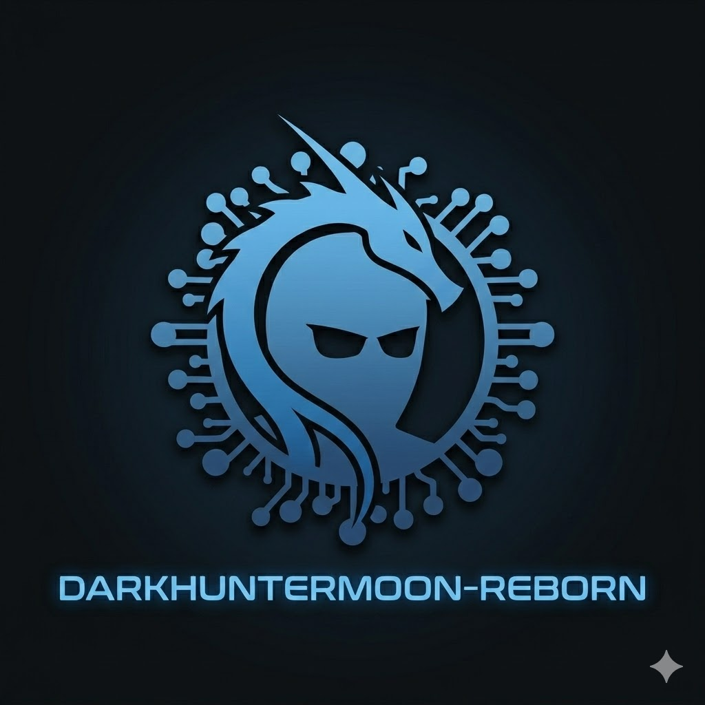

<p align="center">
  
</p>

<h1 align="center">DarkHunterMoon-Reborn</h1>
<p align="center"><i>NetHunter Kernel for POCO X5 5G / Redmi Note 12 5G</i></p>

<p align="center">
  <a href="https://github.com/edbastida/Kernel_Stone_DarkHuntermoon-Reborn/releases/latest"></a>
  
  
  
</p>

> **Devices:** stone · moonstone · sunstone
> **SoC:** Snapdragon 695 5G (SM6375)
> **Kernel:** 5.4.302 (DarkHunterMoon-Reborn)
> **Tested ROM:** Matrixx AOSP (Android 16)

---

## Features

### WiFi & Injection
- **wlan0 native frame injection** — qcacld-3.0 Madara273 5.4.302 series, validated 100% with `aireplay-ng --test`
- mac80211 packet injection patch
- wlan0 monitor mode support (QCACLD-3.0)
- Monitor channel change without restrictions (cfg80211 patch)
- Wireless extensions (CFG80211_WEXT, WEXT_PRIV/SPY) for legacy iwconfig/aireplay tooling
- RTL8188EU driver — TL-WN722N v2/v3 (RTL8188EUS)
- RTL88x2BU driver — AC1200 dual-band adapters
- External USB WiFi adapter support

### Kernel
- Loadable kernel module support (.ko)
- USB HID gadget — BadUSB ready
- USB configfs: RNDIS / CDC-ECM
- Netfilter / iptables / ip6tables
- Bluetooth attack support + external BT adapter (hcibtusb)
- LTO Clang ThinLTO
- Root via Magisk

---

## Build

### Requirements
- Ubuntu 22.04+ (or Docker)
- clang-17, lld-17, llvm-17
- binutils-aarch64-linux-gnu
- Internet connection (~2 GB download)

### Quick start
```bash
git clone https://github.com/edbastida/nethunter-stone
cd nethunter-stone
bash build.sh
# ZIP → out/zip/nethunter-stone-5.4.302-<date>.zip
```

### Build options
```bash
bash build.sh                    # full build
bash build.sh --step=configure   # configure only
bash build.sh --step=compile     # compile only
bash build.sh --step=package     # package only
bash build.sh --clean            # reset all steps
```

### Environment variables
| Variable | Default | Description |
|---|---|---|
| `SKIP_CLONE` | `` | Set to skip re-cloning repos |
| `KERNEL_BRANCH` | `16` | Kernel source branch |
| `JOBS` | `$(nproc)` | Parallel jobs |

---

## Flash

1. Boot into TWRP
2. Install → select ZIP → Swipe to Flash
3. Wipe Cache/Dalvik → Reboot System

```bash
adb push out/zip/nethunter-stone-*.zip /sdcard/Download/
adb reboot recovery
```

---

## Verify after flash

```bash
# Kernel version
uname -r   # 5.4.302-Darkmoon-Reborn

# Connect USB adapter → check interface
iwconfig   # wlan2 present

# Monitor mode
ip link set wlan2 down
iw dev wlan2 set type monitor
ip link set wlan2 up
iw dev wlan2 info   # type: monitor

# Injection test (requires aircrack-ng)
aireplay-ng --test wlan2
# Expected: "Injection is working!"
```

---

## Credits

- [kamikaonashi](https://github.com/kamikaonashi/kernel_xiaomi_stone) — kernel base (Darkmoon-Reborn)
- [osm0sis](https://github.com/osm0sis/AnyKernel3) — AnyKernel3
- [kimocoder](https://github.com/aircrack-ng) — qcacld-3.0 packet injection upstream
- **Loukious** — co-author of the base injection patch
- **Madara273** — qcacld-3.0 5.4.302 port and ABI fixes
- **dr_rootsu, cyberknight777, HelloWorld, Robin, starsea** — debugging in the QCACLD-3 Telegram group
- [aircrack-ng](https://github.com/aircrack-ng/rtl8188eus) — RTL8188EUS driver
- [RinCat](https://github.com/RinCat/RTL88x2BU-Linux-Driver) — RTL88x2BU driver
- Kali NetHunter team — mac80211 injection patch

---

## License

GPL-2.0 — see [LICENSE](LICENSE)
